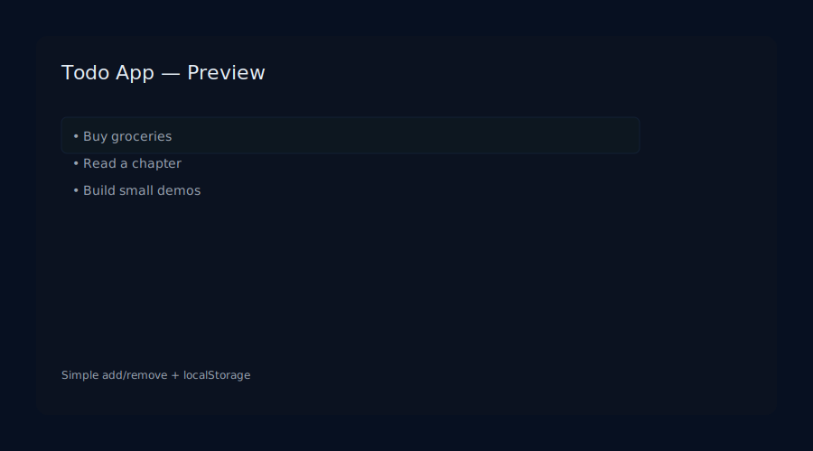
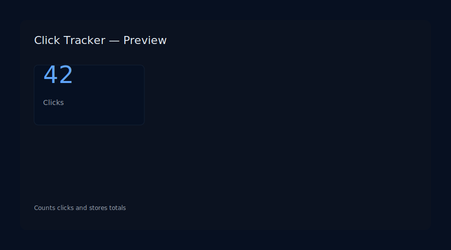
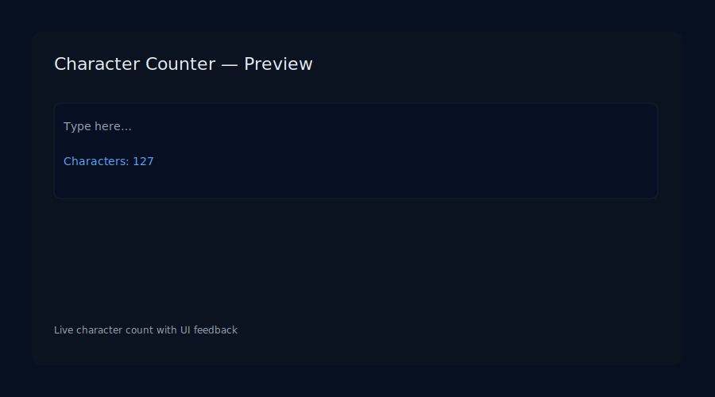
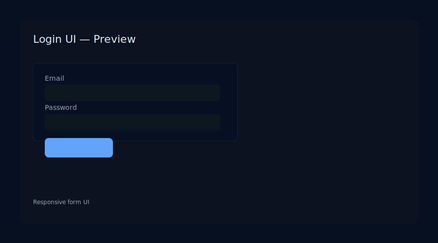
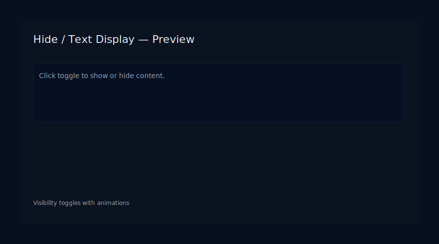
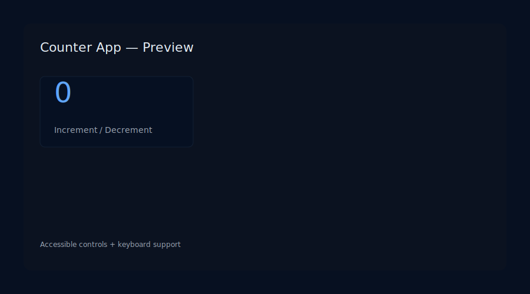
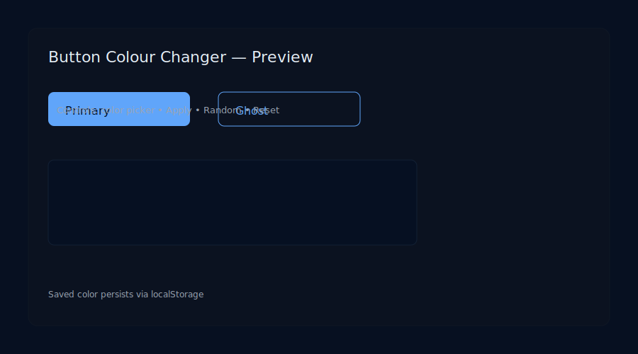
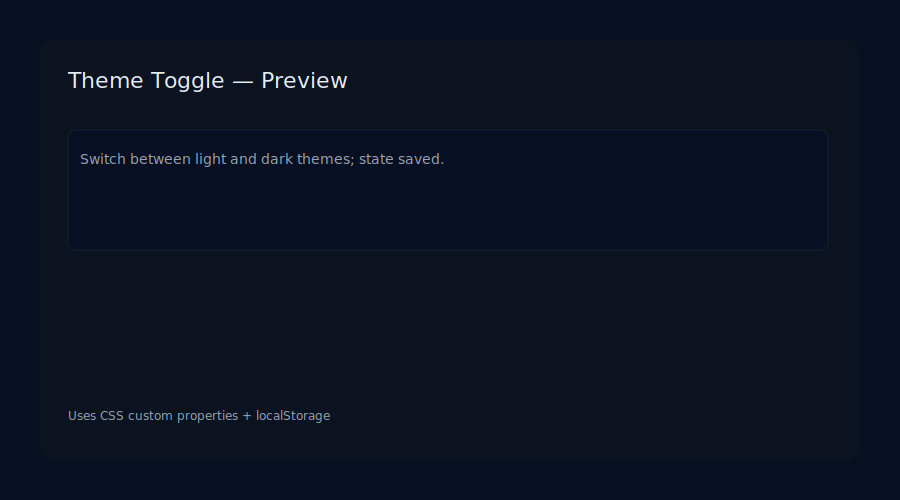

# Nagulan S — Portfolio

Static portfolio for **Nagulan S** (B.E CSE — Agni College Of Technology).

## What is included

- `index.html` — single-page portfolio (Home, About, Projects, Skills, Contact)
- `style.css` — styling for the page
- `script.js` — small scripts (menu toggle and smooth scrolling)
- `projects/` — subfolders for each small demo or project
- `images/` — screenshot placeholders for quick preview

## Project demos (status)

| Project | Status | Demo / Link | Screenshot |
|---|---:|---|---|
| Todo App | Placeholder | `projects/todo-app/` | 
| Click Tracker | Placeholder | `projects/click-tracker/` | 
| Character Counter | Placeholder | `projects/character-counter/` | 
| Login UI | Placeholder | `projects/login-ui/` | 
| Hide / Text Display | Placeholder | `projects/hide-text-display/` | 
| Counter App | Placeholder | `projects/counter-app/` | 
| Button Colour Changer | Implemented ✅ | `projects/button-colour-changer/` | 
| Theme Toggle | Placeholder | `projects/theme-toggle/` | 

> Note: Placeholders are ready to be replaced with your implementations. The **Button Colour Changer** demo is implemented and persists selections via `localStorage`.

## Preview locally

- Open `index.html` in your browser (double-click or serve with a local static server).
- Each project link points to a folder under `projects/` (e.g. `projects/button-colour-changer/index.html`).

## How to push to GitHub

1. Initialize a git repository (if you haven't):

   git init
   git add .
   git commit -m "Initial portfolio"

2. Create a new repository on GitHub (e.g. `nagu02/portfolio`) and follow the instructions to add the remote and push:

   git remote add origin https://github.com/nagu02/your-repo-name.git
   git branch -M main
   git push -u origin main

## Deploy to GitHub Pages
- In the repository settings, enable GitHub Pages and set the source to the `main` branch and `/ (root)` folder.
- This repo includes a GitHub Actions workflow (`.github/workflows/deploy-pages.yml`) that automatically uploads and deploys the site when you push to `main`.
- After publishing, demo pages will be available at:

  `https://nagu02.github.io/your-repo-name/` (root) and
  `https://nagu02.github.io/your-repo-name/projects/button-colour-changer/` (project pages)

## Next steps I can help with

- Replace placeholders with live project code (paste code and I’ll integrate). ✅
- Add screenshots (actual PNGs) of each demo instead of SVG placeholders. 🖼️
- Add GitHub Actions workflow for build and automated deploy. 🔧

---

If you'd like me to embed live screenshots (PNG) or add a CI workflow, tell me which and I’ll proceed.